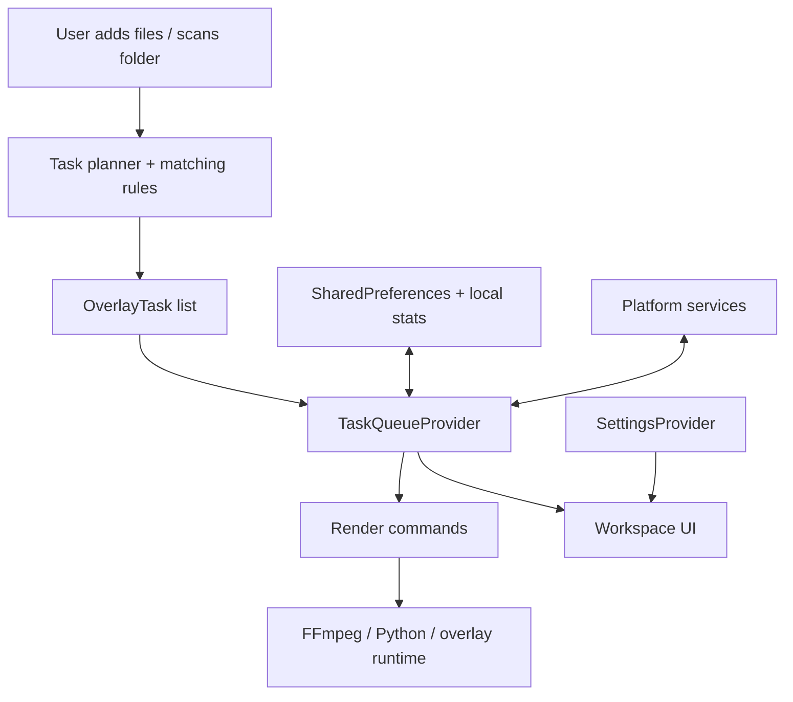

# Architecture

FPV Overlay Toolbox is a Flutter desktop product shell around a render pipeline
that still relies on the right low-level tools for the job: Python, FFmpeg, and
upstream-informed overlay logic.

The goal of the architecture is straightforward:

- keep the desktop UX responsive and easy to reason about
- keep render orchestration isolated from widgets
- keep matching, diagnostics, and packaging explicit enough to review in a public repo

## Layer Responsibilities

| Layer | Responsibility |
|-------|----------------|
| `presentation/` | Desktop UI, navigation, onboarding, queue views, render activity views, settings, and command palette |
| `application/` | ChangeNotifier-driven state for queue processing, workspace behavior, navigation, and settings |
| `domain/` | Task models, task failures, render command contracts, and OS service interfaces |
| `infrastructure/` | File matching, persistence, runtime resolution, subprocess execution, platform services, and overlay command implementations |

## System View

## Queue Lifecycle

1. The user adds files or scans a folder.
2. Matching logic groups candidate files by stem and derives an `OverlayTask`.
3. Incomplete tasks stay visible instead of being discarded, so the queue can act as a recovery workspace.
4. The queue determines whether each task is renderable, missing files, or recoverable through DJI split-clip fallback logic.
5. Rendering is processed through command abstractions rather than from widgets directly.
6. Logs and activity updates are appended during execution so the UI can show high-level progress or raw console detail.

## Matching And Task Model

The queue is intentionally more than a list of files.

- tasks can represent `.srt`, `.osd`, or combined renders
- tasks keep incomplete states visible so the user can repair them
- DJI split clips can reuse the nearest earlier `.osd` when exact telemetry is absent
- failures are classified into task-level reasons rather than surfaced as raw process noise everywhere

That makes the queue useful as a workflow surface, not just a launcher.

## Render Pipeline

Flutter does not do the actual overlay rendering.

Instead:

- Flutter coordinates state, diagnostics, and platform UX
- command implementations build the concrete render invocation
- subprocess helpers execute FFmpeg / Python work
- the bundled runtime scripts prepare a distributable desktop app with the required tools inside it

This split keeps the product shell clean while preserving the rendering stack that already fits the problem well.

## Desktop Product Shell

The presentation layer is intentionally desktop-oriented:

- command palette for keyboard-first actions
- collapsible navigation rail
- queue cards focused on readiness and failure recovery
- activity-first logs instead of only raw console output
- platform integration for notifications and progress indicators

The repo is meant to demonstrate Flutter desktop product work, not just media command execution.

## Persistence

Local persistence is lightweight and explicit:

- app configuration is stored locally with `SharedPreferences`
- local stats remain on-device
- diagnostics reports are copied only when the user asks for them
- no analytics or cloud reporting are part of the public product posture

## Packaging Surfaces

There are three release surfaces in this repo:

- the desktop app
- the packaged macOS update manifest
- the standalone CLI release flow

The unified release workflow in [`.github/workflows/release.yml`](.github/workflows/release.yml)
builds and publishes:

- macOS DMG + checksum
- Windows installer
- macOS CLI archives + checksums
- `latest-macos.json` for app update checks
- Homebrew formula output for the CLI

## Tradeoffs

- The render engine is not rewritten in Dart. That keeps proven tooling in place, but means packaging is more involved.
- The state layer uses pragmatic provider-style orchestration rather than a more abstract architecture stack. That keeps the desktop workflow readable.
- Public support is desktop-first. Mobile folders may exist, but the repo is not positioned as a mobile product launch.
- The source repo stays lightweight by keeping large regression media out of normal clones.

## Where To Read Next

- public overview: [README.md](README.md)
- contributor guidance: [CONTRIBUTING.md](CONTRIBUTING.md)
- release owner steps: [docs/maintainer_release_checklist.md](docs/maintainer_release_checklist.md)
- release validation checklist: [docs/github_release_checklist.md](docs/github_release_checklist.md)
